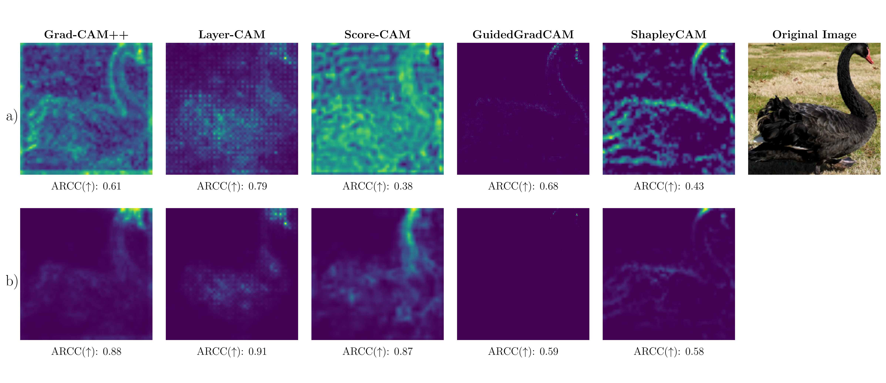

# How to Evaluate and Refine your CAM

This repository contains the code, datasets, and resources associated with the paper "How to Evaluate and Refine your CAM"

## Overview



> Class attribution maps (CAMs) provide local explanations for the decisions of convolutional neural networks. While widely used in practice, the evaluation of CAMs remains challenging due to the lack of ground-truth explanations, making it difficult to evaluate the soundness of existing metrics. Independently, most commonly used CAM methods produce low-resolution attribution maps, which limits their usefulness for detailed interpretability.
> To address the evaluation challenge, we introduce a synthetic dataset with ground-truth attributions that enables a rigorous comparison of CAM evaluation metrics. Using this dataset, we analyze existing metrics and propose ARCC, a new composite metric that more reliably identifies faithful explanations. To address the low resolution issue, we introduce RefineCAM, a method that produces high-resolution attribution maps by aggregating CAMs across multiple network layers. Our results show that RefineCAM consistently outperforms existing methods according to the proposed evaluation.

## Paper

How to Evaluate and Refine Your CAM:

- arXiv: https://arxiv.org/abs/2605.14641
- PDF: https://arxiv.org/pdf/2605.14641.pdf

If you find this work useful, please consider [citing it](#license).

## Installation

### Python venv

1) Clone the repository:

```bash
git clone https://github.com/liuktc/RefineCAM.git
cd RefineCAM
```

2) Create a virtual environment (recommended):

```bash
python -m venv venv
source venv/bin/activate
```

3) Install dependencies:

```bash
pip install -r requirements.txt
```

### Conda env

1) Clone the repository:

```bash
git clone https://github.com/liuktc/RefineCAM.git
cd RefineCAM
```

2) Create a conda environment:

```bash
conda env create -f environment.yml
```

3) Activate the environment:

```bash
conda activate myenv
```

## Datasets

To run the experiments you first need to download the datasets that you want to evaluate on. For each dataset you have to do the following steps:
- ImageNet: Download the ImageNet dataset from [https://image-net.org/download.php] and set the path to the dataset in the environment variable `IMAGENET_ROOT` (see below for details).
- FunnyBirds: Download the FunnyBirds dataset from [https://github.com/visinf/funnybirds-framework] and set the path to the dataset in the environment variable `FUNNYBIRDS_ROOT` (see below for details).
- Synthetic dataset: All the needed images are already included in the repository, so you don't need to download anything for this dataset.

## Usage 

To run experiments on a single model and dataset, execute the following command:

```bash
python run_experiments.py --config_file ./configs/config.yaml
```

If you want to run experiments on different models or datasets, you can modify the config file to specify the desired models and datasets (see folder `configs` for more examples).

## Model Fine-tuning

If you want to execute the script `run_experiments.py` with the synthetic dataset, you need to first fine-tune the model on the synthetic dataset. You can do this by running the following command:

```bash
python fine_tune.py --model vgg11
```

You can replace `vgg11` with any supported model that you want to fine-tune. 

## Environment Variables

The following environment variables can be set to override default paths:

- `IMAGENET_ROOT`: Path to ImageNet dataset (default: "./data/imagenet")
- `FUNNYBIRDS_ROOT`: Path to FunnyBirds dataset (default: "./data/funnybirds/FunnyBirds")

Example usage:
```bash
export IMAGENET_ROOT="/path/to/imagenet"
export FUNNYBIRDS_ROOT="/path/to/funnybirds"
python run_experiments.py --config_file ./configs/config.yaml
```


## License

This project is licensed under the MIT License – see the [LICENSE](https://github.com/liuktc/RefineCAM/blob/master/LICENSE) file for details.

You are free to use, modify, and distribute this code. If you use it for research, please cite the original paper using the following BibTeX entry:

```bibtex
@misc{2605.14641,
      Author = {Luca Domeniconi and Alessandra Stramiglio and Michele Lombardi and Samuele Salti},
      Title = {How to Evaluate and Refine your CAM},
      Year = {2026},
      Eprint = {arXiv:2605.14641},
}
```